# typingGame
PKNU IOT 개발자 교육과정 팀프로젝트 1차

- 1차 개발기간: 2025.03.24 ~ 2025.04.07
- 맡은 담당
    - 한글/ 영어/ 코딩 메뉴 선택 시     
- 구현 기능
    - 로그인/ 회원가입 기능
    - 한글/ 영어/ 코딩 메뉴 선택 후 타수 측정 기능
    - 회원 정보 DB 연결
    - 프로필 이미지 변경 기능

## 1차 팀 프로젝트 결과

### 데이터베이스 구성
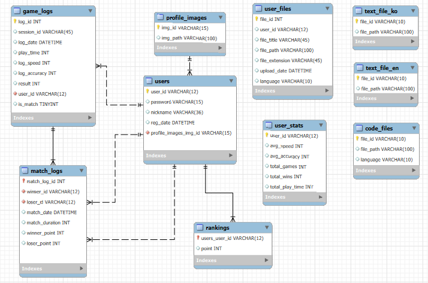

### 테이블 소개
**1. users**
- 사용자 기본 정보 테이블
- 컬럼
    - `user_id(PK)`: 사용자 고유 ID
    - `password`: 비밀번호
    - `nickname`: 닉네임
    - `reg_date`: 가입일
    - `profile_img_id`: 프로필 이미지

**2. profile_images**
- 사용자 프로필 이미지 정보 저장 테이블
- 컬럼
    - `img_id(PK)`: 이미지 고유 ID
    - `img_path`: 이미지 경로

**3. user_files**
- 사용자가 연습 또는 대결에 활용한 텍스트 파일 정보
- 컬럼
    - `file_id(PK)`: 파일 고유 ID
    - `user_id`: 업로더의 ID
    - `file_title`: 파일 제목
    - `file_path`: 파일 경로
    - `file_extension`: 확장자
    - `upload_date`: 업로드 일시
    - `language`: 언어 정보

**4. text_files_ko, text_files_en**
- 시스템에서 제공하는 연습용 텍스트 파일(한국어, 영어 각각 분리)
- 컬럼
    - `file_id(PK)`: 파일 고유 ID
    - `file_path`: 파일 경로

**5. code_files**
- 시스템에서 제공하는 연습용 코딩 파일
    - `file_id(PK)`: 파일 고유 ID
    - `file_path`: 파일 경로
    - `language`: 언어 (C++, PYTHON, JAVA)

**6. game_logs**
- 타자 연습 기록을 저장하는 테이블
- 컬럼
    - `log_id(PK)`: 로그 고유 ID (AI)
    - `session_id`: 게임 세션 고유 ID 
    - `user_id`: 사용자 ID
    - `log_date`: 게임 시작 일시
    - `play_time`: 게임 플레이 시간
    - `log_speed`: 입력 속도 (TPM)
    - `log_accuracy`: 정확도 (%)
    - `is_match`: `0` 이면 연습게임, `1` 이면 타자대결

**7. match_logs**
- 유저 간의 대결 기록을 저장하는 테이블
- 컬럼
    - `match_log_id(PK)`: 대결 고유 ID
    - `winner_id`: 승자 ID
    - `loser_id`: 패자 ID
    - `match_date`: 대결 일시
    - `match_duration`: 대결 소요 시간
    - `winner_point`: 승자 점수
    - `loser_point`: 패자 점수

**8. user_stats**
- 사용자 개인의 통계 데이터를 종합 관리
- 컬럼
- `user_id(PK)`: 사용자 ID
- `avg_speed`: 평균 속도
- `avg_accuracy`: 평균 정확도
- `total_games`: 총 연습 횟수
- `total_wins`: 총 승리 횟수
- `total_play_time`: 총 플레이 시간

**9. rankings**
- 사용자 점수 기반 랭킹 시스템
- 컬럼
- `user_id(FK)`: 사용자 ID
- `point`: 랭킹 점수

### UI 소개
1. 게임 시작 화면
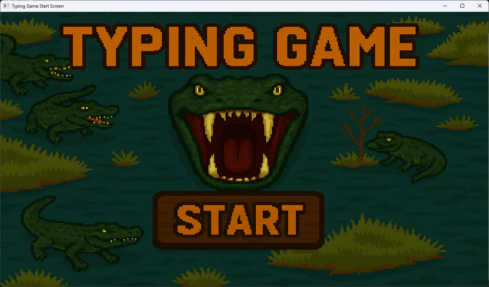

2. 로그인/회원가입 화면
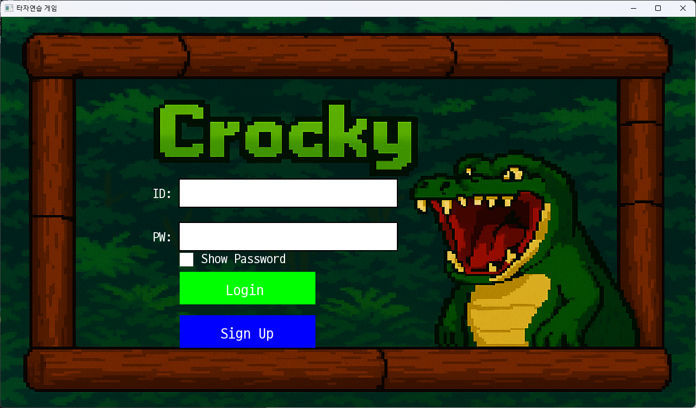
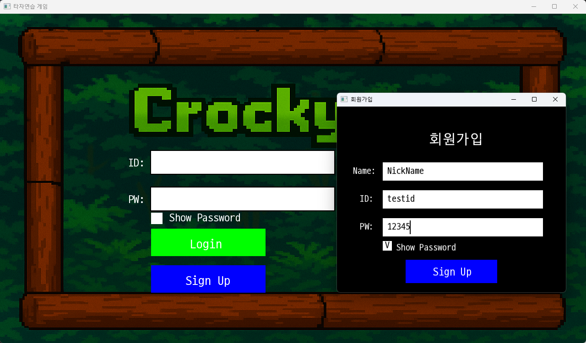

3. 게임 메뉴 선택 화면
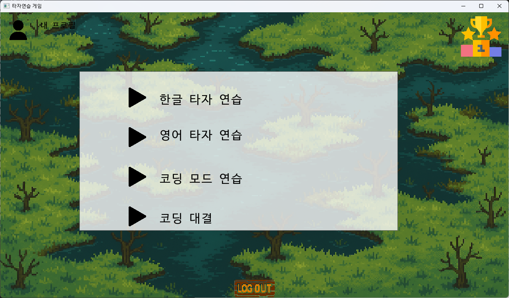
3-1. 한글/영어 선택 시 파일 선택 화면
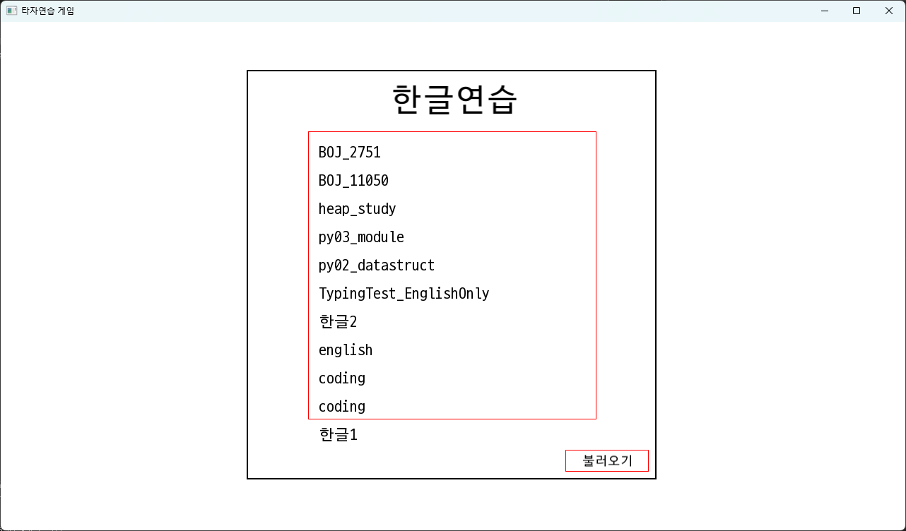
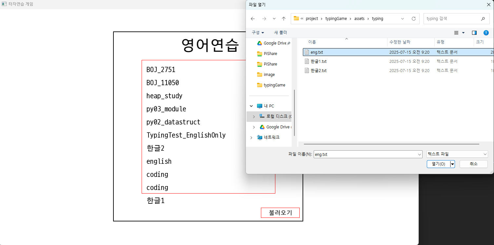
파일불러오기 버튼 클릭 시 파일 탐색기 열림

3-2. 코딩 메뉴 선택 시 언어 선택 화면
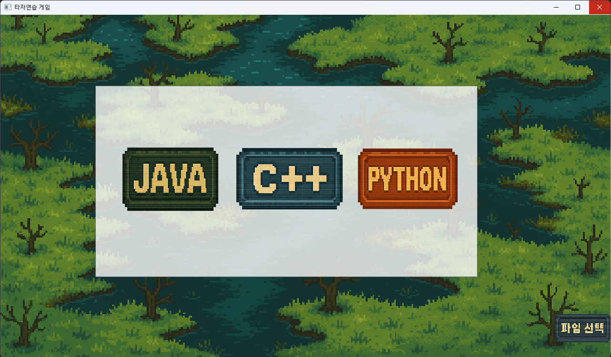

4. 프로필 화면
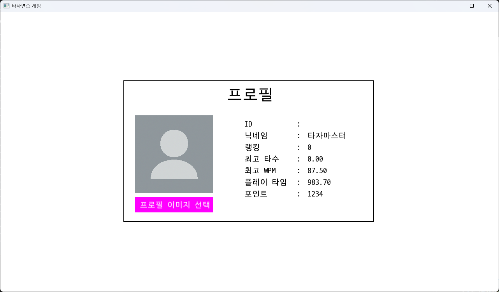
4-1. 프로필 이미지 선택 클릭 시 보이는 화면
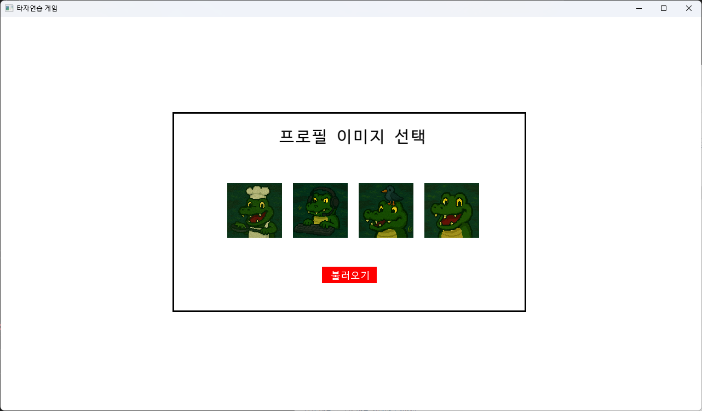
기본 제공 이미지 4장, 불러오기를 통해 사용자 이미지 불러올 수 있음

5. 타자게임 화면
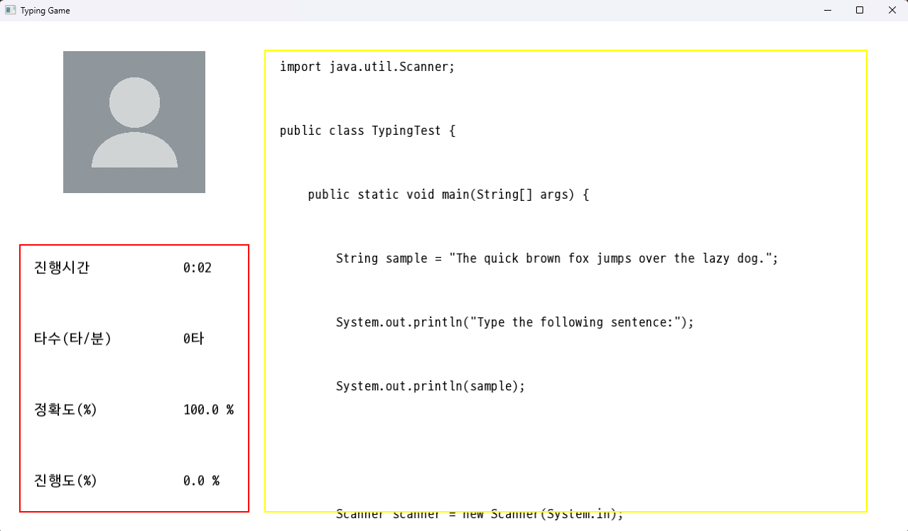
왼쪽 UI를 통해 타자연습 정보를 확인할 수 있음
- 진행시간
- 타수
- 정확도
- 진행도

6. 타자게임 완료 후 결과 화면
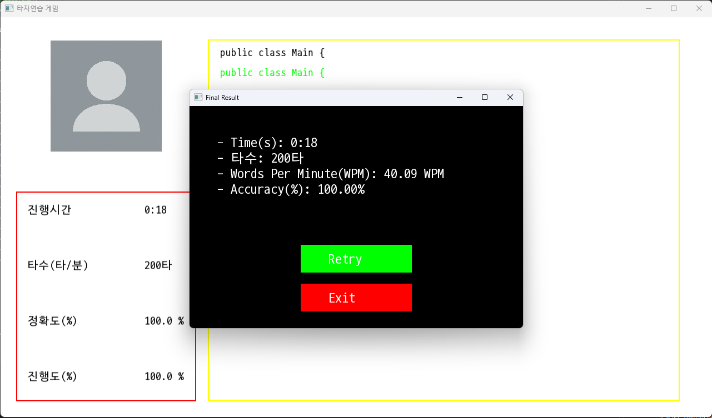
진행도를 다 채웠을 경우 보이는 화면
진행시간, 총 타수, WPM, 정확도 확인 가능

7. 설정 화면
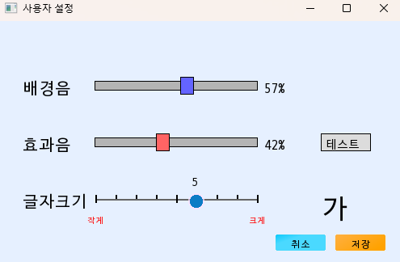
배경음, 효과음, 글자 크기를 조절할 수 있는 UI

